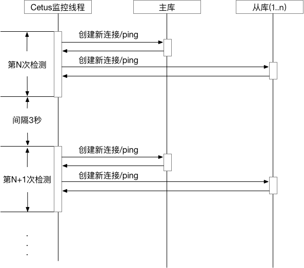
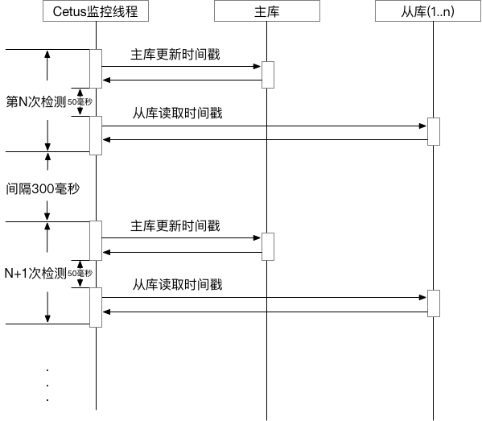
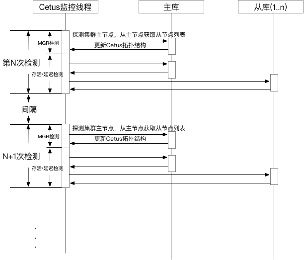

### Cetus监控模块使用及原理介绍
##### 1 概述
Cetus是北京网易乐得DBA团队和SA团队联合打造的一款MySQL数据库中间件。Cetus具有读写分离版本和分库版本，已经部署在网易乐得部门众多线上MySQL集群，性能和稳定性均表现良好。其开源地址为:https://github.com/Lede-Inc/cetus,欢迎star关注。

本文主要对Cetus的监控模块的使用及原理进行介绍，并介绍Cetus使用过程中，监控模块常见的问题及解决方法。

Cetus监控模块拥有独立的监控线程，主要是对Cetus后端各个MySQL实例进行监控，监控的内容主要包括三方面：1 仅监控MySQL实例的存活状态；2 监控主从复制延迟；3 监控MGR集群中主从角色的转换及节点的增删。下面章节将依次详细介绍。

#### 2 相关参数
监控模块的参数主要分三类：1 用于检测后端各个MySQL实例时，使用的账号；2 是否开启主从延迟及主从延迟阈值；3 所支持的MySQL集群模式。

| 参数      |    含义 |
| :--------: | :--------:|
| default-username  | 检测后端MySQL实例使用的账号。<br><b>`注意`，该账号的密码需要在users.json文件中正确配置 |
| check-slave-delay     |   true表示检测主从延迟；false表示不检测主从延迟；默认为false<br><b>`注意`，true/false均小写 |
| slave-delay-down      |    延迟到达该阈值时，会将该DB摘掉，不再提供服务，单位是秒,默认60s |
| slave-delay-recover      |   延迟恢复到该阈值时候，会使之前由于延迟过大摘除的DB重新提供服务，单位是秒，默认30s |
| group-replication-mode      |   1表示支持单主MGR集群模式；0表示普通MySQL集群，默认为0；<br><b>`注意`，暂时不支持多主MGR模式 |

#### 3 监控模块实现原理
##### 3.1 监控存活状态
当Cetus没有配置参数`check-slave-delay`时，或配置该参数值为`false`时候，只会检测后端各个MySQL实例的存活状态，不会检测主从延迟。

Cetus会为监控模块维护一个连接池，按照后端MySQL实例的`ip:port`维度来管理连接池中各个连接。

Cetus会周期性（目前是3秒）的检测后端各个MySQL实例的状态。检测每个MySQL实例的状态时，会首先尝试从监控模块的连接池中，根据该MySQL实例的`ip:port`获取连接，如果成功从连接池中获取到连接，则会调用`mysql_ping()`来检测该MySQL实例是否存活；如果未能从连接池中成功获取连接，则需要调用`mysql_real_connect()`来创建新的连接，通过是否创建成功来判断该MySQL实例是否存活，创建成功的新连接也会随即加入监控模块连接池中。



##### 3.2 监控主从延迟

当Cetus配置了参数`check-slave-delay=true`时，会检测主从延迟，主从延迟实时信息，可以通过命令`select * from backends`执行的结果的`slave delay`列来查看，如果该列显示的值为`2147483647`，则一般表示主从没有配置主从同步。

当主从同步延迟超过`slave-delay-down`时，该MySQL实例会被临时摘掉，不再处理新到来的SQL请求；如果主从同步延迟恢复到`slave-delay-recover`，该MySQL实例会恢复，重新提供服务。设置两个阈值的主要目的是防止在某个阈值附近波动，造成从库的频繁摘除、添加。

Cetus会周期性（300ms）的向主库的`proxy_heart_beat.tb_heartbeat`表更新当前时间戳，随后（50ms后）会从各个从库读取该时间戳，当前时间与该时间戳的差值，则作为主从延迟的时间。

主从延迟的检测依赖于`proxy_heart_beat`库的`tb_heartbeat`表，因此在开启Cetus主从延迟检测功能之前，需要在主库上创建`proxy_heart_beat`库和`tb_heartbeat`表,与此同时，`default-user`需要具有`proxy_heart_beat.tb_heartbeat`表的对应权限。当然也需要成功将该建表信息同步到各个从库上。

```
CREATE TABLE `tb_heartbeat` (
      `p_id` varchar(128) NOT NULL,
      `p_ts` timestamp(3) NOT NULL DEFAULT CURRENT_TIMESTAMP(3),
      PRIMARY KEY (`p_id`)
      ) ENGINE = InnoDB DEFAULT CHARSET = utf8;
```



##### 3.3 支持MGR模式
普通的MySQL集群，主库的高可用一般通过MHA保障。当出现failover时，MHA会进行主从切换，并会通过Cetus的admin端口提供的命令，通知Cetus当前MySQL集群中拓扑结构的变化。

MySQL集群在MGR模式时，当出现failover时，MGR集群内部各个节点会主动进行主从角色的切换；同时可以处理节点的加入与退出。而MGR集群中的这些拓扑结构的改变，无法及时的通知Cetus，因此Cetus需要主动周期性探测MGR集群内部的拓扑结构的变化（节点角色转换、故障节点的删除、新节点的加入等）。

当MySQL集群配置为单主MGR模式后，不再需要使用MHA，需要在Cetus的配置文件中配置`group-replication-mode=1`，使得Cetus自动探测MGR集群拓扑结构的变化。

当设置`group-replication-mode=1`之后，Cetus的监控模块会在`监控存活`和`监控主从延迟`逻辑之前，首先进行拓扑结构的探测。探测时，会首先找到MGR集群中的当前可用的主库，再通过主库找到所有可用的从库，获得主从信息之后，便会修改Cetus内部现有的主从拓扑信息。Cetus中主从拓扑信息修改完成后，再进入`监控存活`或`监控主从延迟`的逻辑。



#### 4 监控模块未来优化
后续Cetus的监控模块会考虑进一步优化，诸如：

1. 监控账号单独，不再使用default-username账号进行监控，更好的进行权限管理。
2. 监控各个MySQL实例时，通过返回值的不同进一步细化流程，提高监控效率和精准度。
3. 监控线程检测的周期，支持参数化配置


#### 5 常见的问题及解决办法
##### 5.1 monitor线程不工作
monitor线程不工作大致有两个原因：

a. 配置文件中配置了`default-username=xxx`，xxx没有在users.json中配置对应密码

日志中会打印提示信息如下：

> 2018-06-19 10:20:13: (warning) no password for , monitor will not work

如遇该问题，配置正确的参数，重启即可。

b. 配置文件中配置了`disable-threads=true`

日志中会打印提示信息如下：

> 2018-06-19 10:40:13: (message) monitor thread is disabled

该参数配置为`true`一般仅用于调试场景，线上环境不需要配置，默认为`false`。

##### 5.2 日志不断的提示监控线程连接不上某MySQL实例

日志中会打印提示信息如下：

> 2018-06-19 11:42:57: (critical) monitor thread cannot connect to backend: ght@172.17.0.5:3306

如遇该问题，当检查MySQL实例和网络没有问题的情况下，可能是由于MySQL实例上没有配置监控线程使用的账号。可以在Cetus所在机器使用监控账号直连MySQL实例，从而确定是否是账号配置的问题。

##### 5.3 日志中循环打印错误日志`Check slave delay no data`

日志中会打印提示信息如下：

> 2018-06-19 11:51:19: (critical) Check slave delay no data:select p\_ts from proxy\_heart\_beat.tb\_heartbeat where p\_id='/home/tsthght/cetus_install/conf\_54321\_12345'

该情况一般是由于从库没有从主库上将用于主从延迟检测的`proxy_heart_beat.tb_heartbeat`表或数据正确同步过来。将主从`proxy_heart_beat.tb_heartbeat`表数据同步即可。


