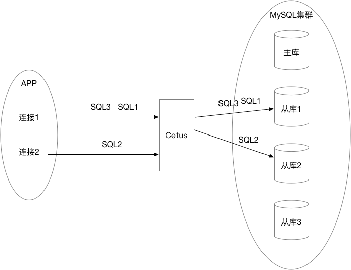

### Cetus负载均衡策略及原理介绍
#### 1 概述
Cetus是北京网易乐得DBA团队和SA团队联合打造的一款MySQL数据库中间件。Cetus具有读写分离版本和分库版本，已经部署在网易乐得部门众多线上MySQL集群，性能和稳定性均表现良好。其开源地址为:https://github.com/Lede-Inc/cetus，欢迎star关注。

本文主要对Cetus的负载均衡的策略及性能优化进行介绍。

本文所讨论的负载均衡，指的是读流量的负载均衡，即读流量如何分配到后端同一MySQL集群内的各个DB。Cetus的负载均衡策略，主要分为两部分：1 主库和从库之间读流量的负载策略；2 从库之间的读流量的负载策略。具体实现时候，流量的分配单位与Atlas等中间件也略有不同，进行了性能优化。下面章节将依次详细介绍。

#### 2 主从库之间的读流量负载策略

默认情况下，非事务中、未通过注释强制路由主库或未使用锁的读流量会优先路由到从库，各个从库之间负载均衡。只有当从库都不可用时，读流量才会路由到主库。

有些业务场景下，主库可以分担部分读流量，这时就涉及到读流量在主库和从库上配置负载策略了。Cetus中，可以通过配置参数`read-master-percentage`来指定默认的读流量路由到主库的百分比，该参数的取值范围是[0, 100]。该值默认为0，即所有读流量会优先路由从库，所有从库均不可用时，才会路由主库；如果该参数设置为100时，则所有读流量都会路由到主库；如果该值设置为(0, 100)时，则会按照设置的比例进行路由。需要注意的是，该值表示的是主库和**所有从库**的比例。

#### 3 从库之间的读流量负载策略

路由到从库的流量，会在各个从库之间进行负载均衡。目前Cetus各个从库之间的读流量负载策略仅支持轮转方式。

在流量分配方面，Cetus也进行了优化。一些MySQL数据库中间件（例如Atlas）是基于SQL的维度做负载均衡的，即不会考虑SQL是否是同一个连接还是不同连接发送来的，中间件依次将接收到的SQL按照策略发往后端的数据库。

在实际使用中发现，长连接的场景下，该策略会造成大量的连接切换，从而造成session级变量的频繁调整，影响SQL执行效率。因此，Cetus对其进行了优化，并非完全按照SQL的维度做负载均衡。Cetus考虑了同一个连接连续发送SQL请求的情况，不会立即将当前SQL使用完的Cetus与MySQL的连接放回连接池复用，而是持有短暂（256毫秒）时间，以期后续仍有SQL执行，从而避免了session级变量的调整，大大增加了SQL执行的效率。

使用sysbench对优化前后的Cetus进行了简单测试，通过测试发现，通过优化后的Cetus针对长连场景下的读流量的吞吐量有了明显提升。

#### 4 读流量的路由策略总结
在存在至少1个**可用从库**的情况下，影响**查询语句**的路由策略的因素主要有：

- 1 事务中的查询 
- 2 `select...for update`  
- 3 Cetus设置参数`master-preferred=true`所有流量全部路由主库 
- 4 Cetus设置参数`read-master-percentage`控制主从读流量负载 
- 5 使用注释`/*#mode=READWRITE*/`或`/*mode=READONLY*/`。

默认情况下，读流量会优先路由到从库，从库之间按照**轮训策略**在各个从库之间做负载均衡；一旦所有从库均不可用，会路由到主库上。目前Cetus的各个从库暂不支持按照权重做负载。

对于第1、2、3点，Cetus会将查询语句直接路由主库。

对于第4点，如果设置`read-master-percentage=100`，所有的查询流量均路由到主库；如果设置`read-master-percentage=[0, 100)`，Cetus会将读流量按照该比例路由到主库和从库。注意，这里的从库指的是全部的从库，即该比例指的是主库和全部从库的比例。

对于第5点，如果使用注释`/*#mode=READWRITE*/`，读流量会路由到主库；如果使用注释`/*#mode=READONLY*/`读流量会路由从库，如果所有从库均不可用时才会**路由到主库**。

上面的各个因素的优先级，注释的优先级最高，其次是参数`master-preferred`，最后是参数`read-master-percentage`。
